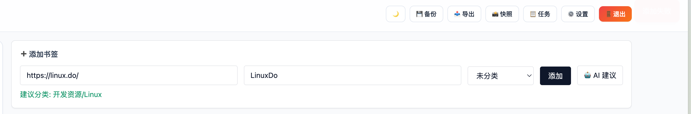
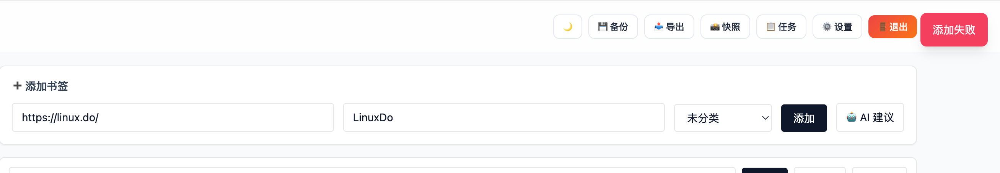
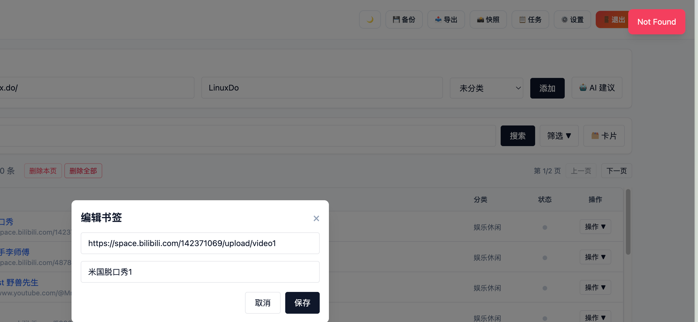
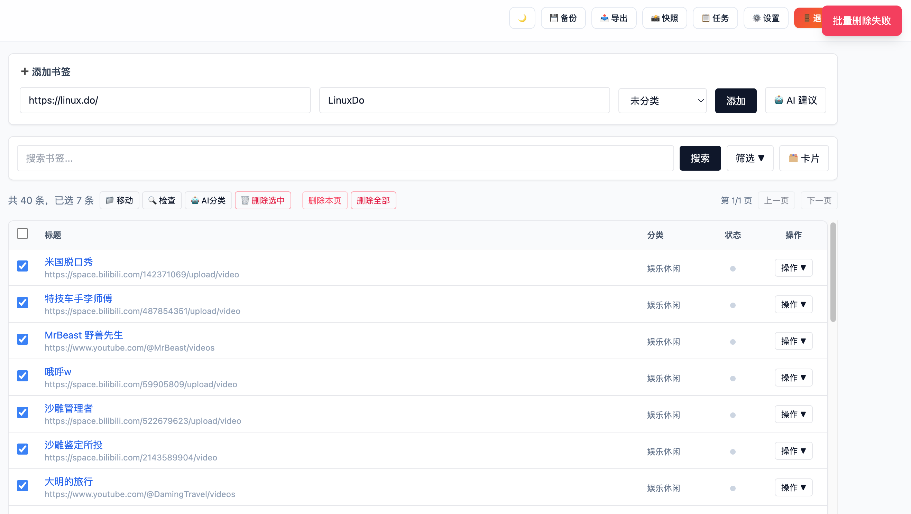
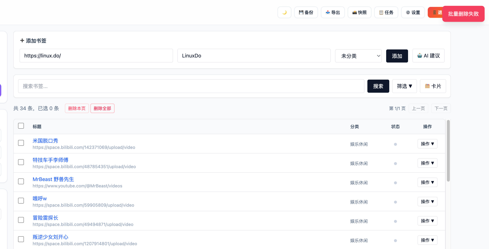
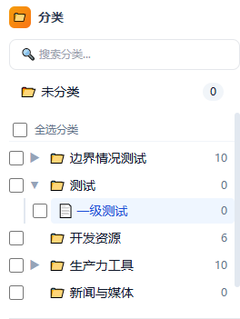

1.TC-BM-001: 添加书签（含 AI 分类建议）
添加失败如图：

2.TC-BM-002: 添加重复 URL 书签
添加失败如图：

3.TC-BM-003: 编辑书签
编辑失败：

4.TC-BM-004: 添加/编辑书签描述
无此功能

5.TC-BM-007: 批量删除书签
删除失败：

6.TC-BM-008: 删除当前页所有书签
删除失败：

7.TC-BM-010: 搜索书签（去抖动）
当前有搜索框（有搜索按钮，有去抖动的话应该去掉搜索按钮），有去抖动效果，但仅限当前选中分类内搜索：

8.TC-CAT-004: 修改分类名称
无编辑名称相关入口（按钮）：

9.TC-CAT-005: 设置分类图标和颜色
设置图标和颜色无效，无反应

10.TC-IO-004: 导出为 HTML 格式
导出失败，返回：
{"message":"Route GET:/export not found","error":"Not Found","statusCode":404}

11.TC-IO-005: 导出为 JSON 格式
导出失败，返回：
{"message":"Route GET:/export not found","error":"Not Found","statusCode":404}

12.TC-IO-006: 导出为 TXT 格式
无导出TXT格式选项

13.TC-IO-007: 按选中分类导出
无此该选项，代码中应该是有的，目前无入口

14.TC-AI-R01: 应用建议时书签已被删除
实际为建议页里对应书签消失

15.TC-AI-R02: 应用精简建议时目标分类已被删除
有应用按钮，点击提示已应用，同时会创建新分类，但是目标分类的书签没有移动到新分类，符合期望

16.TC-AI-R04: 精简任务后分类已被其他操作删除
无法复现

17.